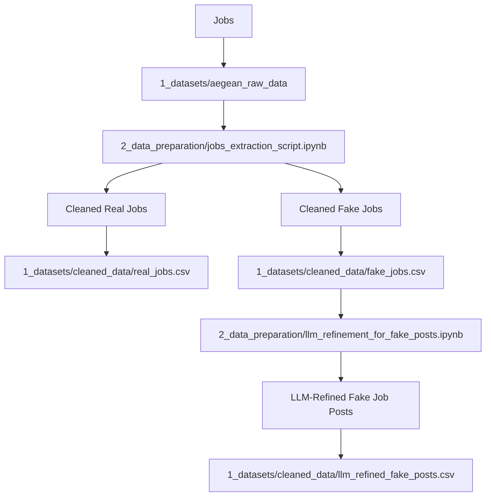

# Data Preparation

This folder includes notebooks that are used to process and clean [**raw dataset**](https://github.com/MIT-Emerging-Talent/ET6-CDSP-group-21-repo/blob/28fb2c5be79be0883c8366fb2b4bacbbec9c6809/1_datasets/aegean_raw_data).

All cleaned datasets are saved in [**1_datasets**](https://github.com/MIT-Emerging-Talent/ET6-CDSP-group-21-repo/blob/e46c53bf17c3d608c8e67b607300d9faf4b6043e/1_datasets).
The main purpose of processing the raw dataset is to build clean versions that
are well structed to be utilized by all team members.

---

## Scripts Overview

### [`jobs_extraction_script.ipynb`](https://github.com/MIT-Emerging-Talent/ET6-CDSP-group-21-repo/blob/14894562ec2b519501aaed5b0525f54313fdfb0f/2_data_preparation/jobs_extraction_script.ipynb)

**Purpose:** Extract all real and fake jobs from the raw dataset.

- **Input:**
  [`../1_datasets/aegean_raw_data/all_job_postings.csv`](https://github.com/MIT-Emerging-Talent/ET6-CDSP-group-21-repo/blob/28fb2c5be79be0883c8366fb2b4bacbbec9c6809/1_datasets/aegean_raw_data)

- **Process:**
  - Filtering rows where the `fraudulent` column equals 0 and assigns them to
real jobs dataset.
  - Filtering rows where the `fraudulent` column equals 1 and assigns them to
fake jobs dataset.
  - Since the main goal of the project is to do NLP, all columns with numerical
values except for `fraudulent` and `salary_range` were dropped.
  - Ensuring all job posts are included without dropping any rows, and
replacing all NaN values with empty strings to avoid any conflict with NLP.

- **Output:**
  - Cleaned Real Jobs: [`../1_datasets/cleaned_data/real_jobs.csv`](https://github.com/MIT-Emerging-Talent/ET6-CDSP-group-21-repo/blob/14894562ec2b519501aaed5b0525f54313fdfb0f/1_datasets/cleaned_data/real_jobs.csv)
  - Cleaned Fake Jobs: [`../1_datasets/cleaned_data/fake_jobs.csv`](https://github.com/MIT-Emerging-Talent/ET6-CDSP-group-21-repo/blob/14894562ec2b519501aaed5b0525f54313fdfb0f/1_datasets/cleaned_data/fake_jobs.csv)

---

### [`llm_refinement_for_fake_jobs.ipynb`](https://github.com/MIT-Emerging-Talent/ET6-CDSP-group-21-repo/blob/99c09b2c71069d23941f77a17c97d23fb38d4aa6/2_data_preparation/llm_refinement_for_fake_jobs.ipynb)

- **Input:**
 [`../1_datasets/cleaned_data/fake_jobs.csv`](https://github.com/MIT-Emerging-Talent/ET6-CDSP-group-21-repo/blob/14894562ec2b519501aaed5b0525f54313fdfb0f/1_datasets/cleaned_data/fake_jobs.csv)

**Purpose:** Use LLM, specifically **Gemini** to rewrite all previously cleaned
fake job posts to mimic the real job posts while also maintaining a scam-like structure.

- **Process:**
  - Cleaning all values by removing punctuation and special characters.
  - Sending job `descriptions`, `requirements`, and `benefits` to the Gemini
API to refine the text provided in all three columns.
  - Receives refined text with more robustness and level of detail.

- **Output:**
[`../1_datasets/cleaned_data/llm_refined_fake_posts2.csv`](https://github.com/MIT-Emerging-Talent/ET6-CDSP-group-21-repo/blob/1559fd4f70f49837b9626a46db57799e8c5a39da/1_datasets/cleaned_data/llm_refined_fake_posts2.csv)

---

This graph demonstrates and summarizes the data cleaning pipeline process.
