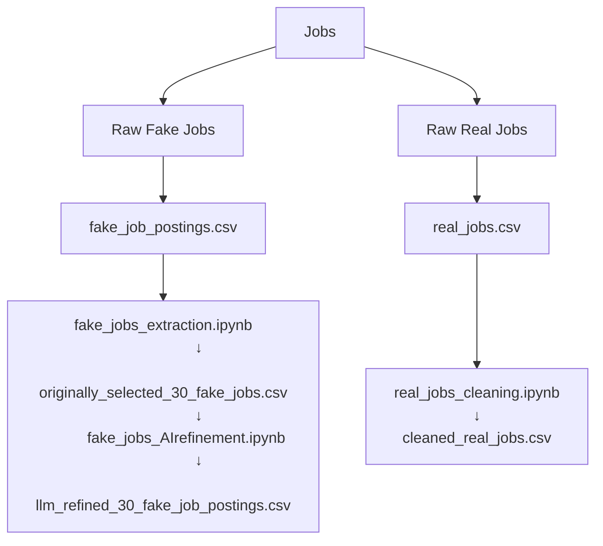

# Data Preparation

This folder contains scripts that prepare and process datasets required for
training and evaluating models to detect fake job postings.

---

## Scripts Overview

### [`fake_jobs_extraction_script.ipynb`](https://github.com/MIT-Emerging-Talent/ET6-CDSP-group-21-repo/blob/main/2_data_preparation/fake_jobs_AIrefinement_script.ipynb)

**Purpose**: Extract a diverse sample of fake job listings from the raw dataset.

- **Input**:  
  [`../1_datasets/raw_fake_jobs/fake_job_postings.csv`](https://github.com/MIT-Emerging-Talent/ET6-CDSP-group-21-repo/blob/main/1_datasets/raw_fake_jobs/fake_job_postings.csv)

- **Process**:  
  - Filters rows where the `fraudulent` column equals 1  
  - Randomly selects 30 diverse fake job entries

- **Output**:  
  [`../1_datasets/processed_fake_jobs/originally_selected_30_fake_jobs.csv`](https://github.com/MIT-Emerging-Talent/ET6-CDSP-group-21-repo/blob/main/1_datasets/processed_fake_jobs/originally_selected_30_fake_jobs.csv)

---

### [`fake_jobs_AIrefinement_script.ipynb`](https://github.com/MIT-Emerging-Talent/ET6-CDSP-group-21-repo/blob/main/2_data_preparation/fake_jobs_AIrefinement_script.ipynb)

**Purpose**: Use LLM (e.g. Gemini) to rewrite selected fake jobs to sound more
realistic and professional while maintaining a scam-like structure.

- **Input**:  
  [`../1_datasets/processed_fake_jobs/originally_selected_30_fake_jobs.csv`](https://github.com/MIT-Emerging-Talent/ET6-CDSP-group-21-repo/blob/main/1_datasets/processed_fake_jobs/originally_selected_30_fake_jobs.csv)

- **Process**:  
  - Sends job descriptions through the Gemini API  
  - Receives refined text with more realism and detail

- **Output**:  
  [`../1_datasets/processed_fake_jobs/llm_refined_30_fake_job_postings.csv`](https://github.com/MIT-Emerging-Talent/ET6-CDSP-group-21-repo/blob/main/1_datasets/processed_fake_jobs/llm_refined_30_fake_job_postings.csv)

---

### [`real_jobs_cleaning_script.ipynb`](https://github.com/MIT-Emerging-Talent/ET6-CDSP-group-21-repo/blob/main/2_data_preparation/real_jobs_cleaning_script.ipynb)

**Purpose**: Clean and standardize the real job postings dataset.

- **Input**:  
  [`../1_datasets/raw_real_jobs/real_jobs.csv`](https://github.com/MIT-Emerging-Talent/ET6-CDSP-group-21-repo/blob/main/1_datasets/raw_real_jobs/real_jobs.csv)

- **Process**:  
  - Removes unwanted columns  
  - Cleans text: lowercasing, punctuation stripping, whitespace trimming  
  - Drops null values and duplicates

- **Output**:  
  [`../1_datasets/cleaned_real_jobs/cleaned_real_jobs.csv`](https://github.com/MIT-Emerging-Talent/ET6-CDSP-group-21-repo/blob/main/1_datasets/cleaned_real_jobs/cleaned_real_jobs.csv)

---

This graph demonstrates and summarizes the data cleaning process.
