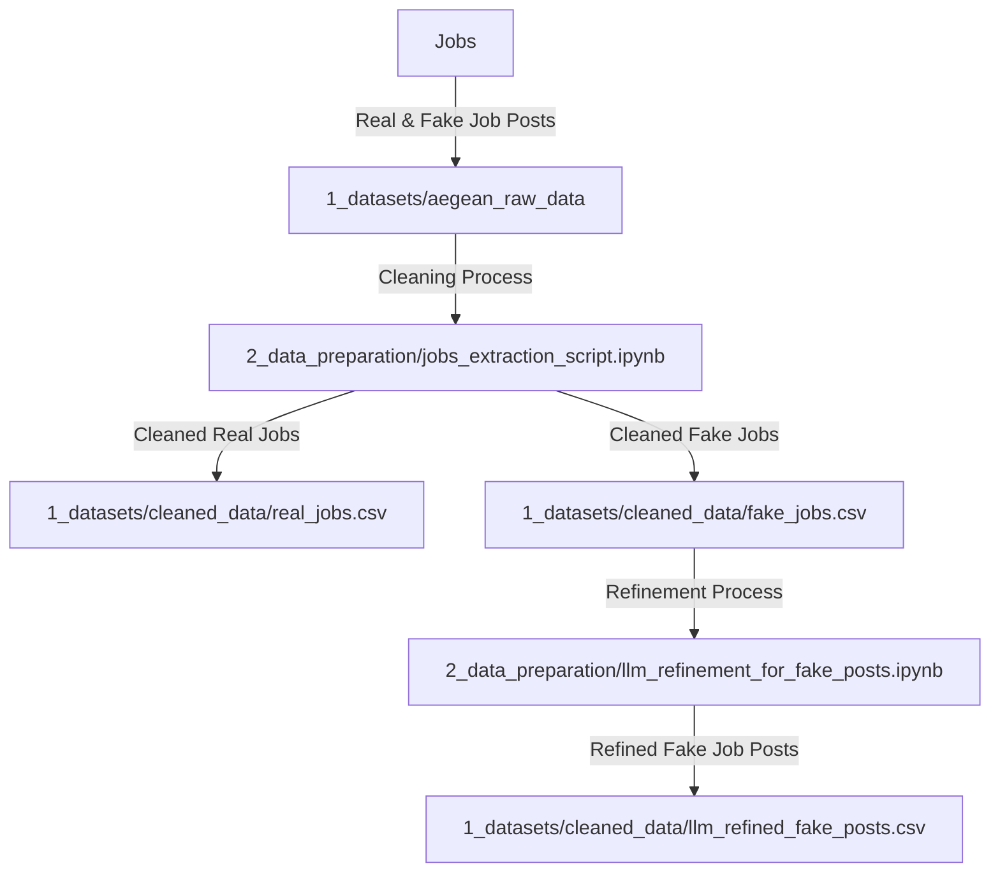
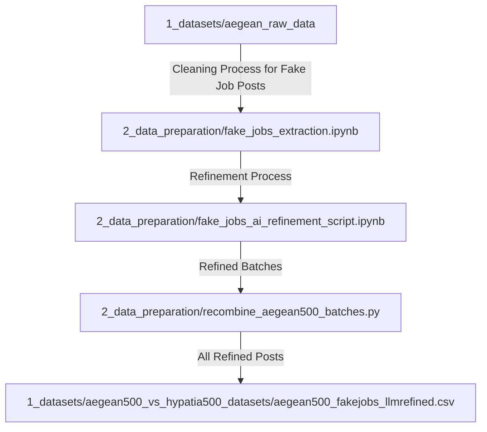

# Data Preparation

This folder includes notebooks that are used to process and clean the
[**Aegean raw dataset**](https://github.com/MIT-Emerging-Talent/ET6-CDSP-group-21-repo/blob/28fb2c5be79be0883c8366fb2b4bacbbec9c6809/1_datasets/aegean_raw_data).

All cleaned datasets are saved in [**1_datasets**](https://github.com/MIT-Emerging-Talent/ET6-CDSP-group-21-repo/blob/e46c53bf17c3d608c8e67b607300d9faf4b6043e/1_datasets).
The main purpose of processing the raw dataset is to build clean versions that
are well structured to be utilized by all team members.

---

## Scripts Overview Part 1

In this part we cover the scripts used with **_both_** real and fake job posts **_extracted_**
from the **_Aegean_** dataset **_only_**.

### [`jobs_extraction_script.ipynb`](https://github.com/MIT-Emerging-Talent/ET6-CDSP-group-21-repo/blob/14894562ec2b519501aaed5b0525f54313fdfb0f/2_data_preparation/jobs_extraction_script.ipynb)

**Purpose:** Extracting all real and fake jobs from the raw dataset.

- **Input:**
[`../1_datasets/aegean_raw_data/all_job_postings.csv`](https://github.com/MIT-Emerging-Talent/ET6-CDSP-group-21-repo/blob/28fb2c5be79be0883c8366fb2b4bacbbec9c6809/1_datasets/aegean_raw_data).

  - The shape of the dataset is (17880, 18).

- **Process:**
  - Filtering rows where the `fraudulent` column equals 0 and assigns them to
**real** jobs dataset.
  - Filtering rows where the `fraudulent` column equals 1 and assigns them to
**fake** jobs dataset.
  - Ensuring all job posts are included without dropping any rows, and
**replacing** all NaN values with **empty strings** to avoid any conflict with NLP.
  - Since the main goal of the project is to do NLP, **all** columns with **numerical**
values **_except_** for `fraudulent` and `salary_range` were dropped.

- **Output:**
  - Cleaned Real Jobs: [`../1_datasets/cleaned_data/real_jobs.csv`](https://github.com/MIT-Emerging-Talent/ET6-CDSP-group-21-repo/blob/14894562ec2b519501aaed5b0525f54313fdfb0f/1_datasets/cleaned_data/real_jobs.csv).
    - The shape of the dataset after cleaning is (17014, 11).
  - Cleaned Fake Jobs: [`../1_datasets/cleaned_data/fake_jobs.csv`](https://github.com/MIT-Emerging-Talent/ET6-CDSP-group-21-repo/blob/14894562ec2b519501aaed5b0525f54313fdfb0f/1_datasets/cleaned_data/fake_jobs.csv).
    - The shape of the dataset after cleaning is (866, 11).

---

### [`llm_refinement_for_fake_jobs.ipynb`](https://github.com/MIT-Emerging-Talent/ET6-CDSP-group-21-repo/blob/99c09b2c71069d23941f77a17c97d23fb38d4aa6/2_data_preparation/llm_refinement_for_fake_jobs.ipynb)

- **Input:**
[`../1_datasets/cleaned_data/fake_jobs.csv`](https://github.com/MIT-Emerging-Talent/ET6-CDSP-group-21-repo/blob/14894562ec2b519501aaed5b0525f54313fdfb0f/1_datasets/cleaned_data/fake_jobs.csv)

**Purpose:** Using LLM, specifically **Gemini** to rewrite all previously cleaned
fake job posts to mimic the real job posts while also maintaining a
scam-like structure, in order to reveal the modern scam tactics in the era of AI.

- **Process:**
  - Cleaning all values by removing punctuation and special characters.
  - Sending job `company_profile`, `descriptions`, `requirements`, and `benefits`
to the Gemini API to refine the text provided in all three columns. A clear
prompt was added to execute this process, and then the refined versions were
added to separate columns, which are `refined_company_profile`,
`refined_description`, `refined_requirements`, and `refined_benefits`.
  - Receives refined text with more robustness and level of detail.

- **Output:** [`../1_datasets/cleaned_data/llm_refined_fake_posts2.csv`](https://github.com/MIT-Emerging-Talent/ET6-CDSP-group-21-repo/blob/1559fd4f70f49837b9626a46db57799e8c5a39da/1_datasets/cleaned_data/llm_refined_fake_posts2.csv).

  - The shape of the dataset after refinement is (866, 15).

---

This graph demonstrates and summarizes the data cleaning pipeline process for
the Aegean data set only.

---

## Scripts Overview Part 2

In this part we cover the scripts used with **_real_** jobs posts
**_extracted_** from **_Indeed_** and **_fake_** jobs posts **_extracted_**
from the **_Aegean_** dataset.

### [`fake_jobs_extraction_script.ipynb`](https://github.com/MIT-Emerging-Talent/ET6-CDSP-group-21-repo/blob/e11da9e010dce191344d616e9a76033434e5990d/2_data_preparation/fake_jobs_extraction_script.ipynb)

- **Input:**
[`../1_datasets/aegean_raw_data/all_job_postings.csv`](https://github.com/MIT-Emerging-Talent/ET6-CDSP-group-21-repo/blob/28fb2c5be79be0883c8366fb2b4bacbbec9c6809/1_datasets/aegean_raw_data/all_job_postings.csv).

  - The shape of the dataset is (17880, 18).

**Purpose:** Extracting 500 fake job posts from the raw dataset.

- **Process:**
  - Filtering rows where the `fraudulent` column equals 1 and assigns them to
fake jobs dataset.
  - Dropping all columns except for six columns, then dropping the missing
values in each column.
  - Keeping the `description` and `benefits` to be refined by Gemini.

- **Output:**
[`../1_datasets/aegean500_vs_hypatia500_datasets/aegean500_fakejobs.csv`](https://github.com/MIT-Emerging-Talent/ET6-CDSP-group-21-repo/blob/e46c53bf17c3d608c8e67b607300d9faf4b6043e/1_datasets/aegean500_vs_hypatia500_datasets/aegean500_fakejobs.csv).

  - Shape of the dataset after cleaning is (500, 6).

### [`fake_jobs_ai_refinement_script.ipynb`](https://github.com/MIT-Emerging-Talent/ET6-CDSP-group-21-repo/blob/45e6f20e86ab58f0184eb23a264212bb8cdc0798/2_data_preparation/fake_jobs_ai_refinement_script.ipynb)

- **Input:**
[`../1_datasets/aegean500_vs_hypatia500_datasets/aegean500_fakejobs.csv`](https://github.com/MIT-Emerging-Talent/ET6-CDSP-group-21-repo/blob/e46c53bf17c3d608c8e67b607300d9faf4b6043e/1_datasets/aegean500_vs_hypatia500_datasets/aegean500_fakejobs.csv).

**Purpose:** Using Gemeni to refine all 500 fake job posts that were extracted
from the raw dataset.

- **Process:**
  - Dividing the 500 fake job posts into batches of 84, each batch to be refined
by one team member.
  - Sending job `description` to the Gemini API to refine the text provided in
this column. A clear prompt was added to execute this process. Then the
refined version will be added to a separate column, which is `refined_description`,
along with extra two columns, `refinement_status` and `refinement_errors` for
tracking purposes.
  - Receiving refined text by each team member.

- **Output:**
  - Individual batch refinement, includes 84 fake posts per batch: [`../1_datasets/fakejobs_to_refine`](https://github.com/MIT-Emerging-Talent/ET6-CDSP-group-21-repo/blob/08990371387dcddd06fb6f3361478bf4c33d45fb/1_datasets/fakejobs_to_refine).
  - All batches after executing the refinement process: [`../1_datasets/fakejobs_refined`](https://github.com/MIT-Emerging-Talent/ET6-CDSP-group-21-repo/blob/8251dfa7db2ae2e0b35c3e619dd3c7f6e52af037/1_datasets/fakejobs_refined).

  - The shape of the dataset after cleaning is (500, 9).

### [`recombine_aegean500_batches.ipynb`](https://github.com/MIT-Emerging-Talent/ET6-CDSP-group-21-repo/blob/45e6f20e86ab58f0184eb23a264212bb8cdc0798/2_data_preparation/recombine_aegean500_batches.py)

- **Input:**
[`../1_datasets/fakejobs_refined`](https://github.com/MIT-Emerging-Talent/ET6-CDSP-group-21-repo/blob/8251dfa7db2ae2e0b35c3e619dd3c7f6e52af037/1_datasets/fakejobs_refined)

- **Purpose:** Recombining all the individual batches of fake job posts
refinements into one `.csv` file.

- **Process:**
  - Recombining all the 5 batches in the input file and saved it in one output file.

- **Output:**
[`../1_datasets/aegean500_vs_hypatia500_datasets/aegean500_fakejobs_llmrefined.csv`](https://github.com/MIT-Emerging-Talent/ET6-CDSP-group-21-repo/blob/e46c53bf17c3d608c8e67b607300d9faf4b6043e/1_datasets/aegean500_vs_hypatia500_datasets/aegean500_fakejobs_llmrefined.csv).

  - The shape of the dataset after refinement is (500, 9).

---

