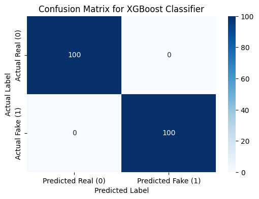

# Detecting AI-Generated Job Scams: A human and Machine Perspective

## Project Overview

The digital job market is facing an alarming rise in **sophisticated
fraudulent job postings crafted by advanced generative AI.** As scammers
increasingly leverage powerful AI, traditional detection methods—reliant
on linguistic cues and behavioral red flags—are proving insufficient.

Our study dives deep into the critical intersection of **cybersecurity**,
**human behavior**, and **Natural Language Processing (NLP)**. We pose a
fundamental question: *What happens when scammers have access to the same
AI tools used to detect them?*

This research is profoundly vital. According to the Federal Trade
Commission, reported losses from job opportunity scams soared to
**$750.6 million in 2024**, marking a nearly **$250 million increase from
2023**. These escalating figures underscore the urgent need for new,
effective defensive strategies.

**Comprehensive Domain Study & Problem Analysis:**
[Dive Deeper Here](https://github.com/MIT-Emerging-Talent/ET6-CDSP-group-21-repo/tree/main/0_domain_study)

---

**Can ~~*humans~~ and Classifier Models still distinguish between legitimate and
fraudulent job postings when the scam text is written by advanced AI models?**

To address this crucial inquiry, we investigated:

* How do genuine and AI-generated scam job postings compare linguistically?
* What markers distinguish AI-written scams from human-written scams?
  
>Humans part will be investigated in ELO2

---

## Detection Strategy & Workflow

We analyzed a curated set of real and fake job postings to study how
AI-generated scams differ linguistically from human-written real jobs.
We also refined each fake post using LLMs to create realistic yet
deceptive examples.

## Data & Methodology

### Datasets Used

Our analysis is based on the **Fake Job Postings** dataset from Kaggle,
which contains 17,880 job postings. To enhance the realism of fraudulent
listings, we refined each one using a Large Language Model (LLM) like
Gemini to mimic legitimate language patterns while preserving deceptive
cues.

For a full overview of our data sources, their collection, and
limitations, please see the [**`1_datasets/README.md`**](https://github.com/MIT-Emerging-Talent/ET6-CDSP-group-21-repo/tree/main/1_datasets)

### Data Processing Pipeline

Our robust data processing pipeline prepares all the data needed for
our experiment. It involves:

* **Extracting Fake Jobs**: Selecting initial fake job listings.
* **AI Refining Fake Jobs**: Using LLMs (like Gemini) to make fake jobs
  super realistic.
* **Cleaning Real Jobs**: Standardizing authentic job postings.

The scripts for this entire process, from data cleaning to refinement,
are located in the [**`2_data_preparation`**](https://github.com/MIT-Emerging-Talent/ET6-CDSP-group-21-repo/tree/main/2_data_preparation).

### Exploratory Data Analysis (EDA)

Before our main analysis, we performed a comprehensive EDA to understand
the dataset's characteristics and identify key patterns. This phase
helped us spot critical red flags like missing data and linguistic cues
that would inform our modeling approach.

You can explore our data exploration notebooks and findings in the
[**`3_data_exploration`**](https://github.com/MIT-Emerging-Talent/ET6-CDSP-group-21-repo/tree/main/3_data_exploration)

---

## Hypotheses

We explored two main hypotheses throughout our project:

1. **Main Hypothesis:**  
   Human-written and AI-generated fake job listings differ
   significantly in their linguistic patterns from real job listings.

2. **Sub-Hypothesis:**  
   AI-generated scams are more polished and persuasive, making them
   potentially harder to detect than human-written scams.

Our visual analyses support both hypotheses by revealing distinct
word usage patterns, repetition in structure, and thematic exaggeration
in fake listings.

## Non-Technical Explanation of Findings

Our project investigates the linguistic patterns found in fake or
AI-generated job postings by comparing them to authentic human-written
listings. Using natural language processing (NLP) techniques, we explored
how language can be a signal of authenticity or deception.

Fake job descriptions often rely on vague or overly persuasive language to
attract attention. Phrases like "quick hire", "no experience", or "urgent
need" appeared frequently in fraudulent listings. These kinds of phrases
are designed to create urgency or appeal to job seekers without offering
much substance.

We also observed that some AI-generated postings are overly polished or
mechanically structured. Readability tests showed unusual sentence
complexity or artificial smoothness, contrasting with the more varied and
natural tone found in human-written descriptions.

Grammar analysis, through Part-of-Speech tagging, revealed overuse of
adjectives and repetitive sentence patterns in fake posts. Meanwhile,
named entity recognition sometimes flagged company or location names that
appeared fabricated or oddly placed.

### Visual Evidence

#### Word Frequency Distribution

This chart shows the most common words used across different types of job
descriptions. It highlights how certain terms are more frequent in fake or
AI-generated listings, providing a visual cue to potential fraud.

### XGBoost Classifier Performance

Our XGBoost model achieved **100% accuracy** —
but that perfection revealed **stylistic data leakage**.

> The model learned to identify *writing styles*
> (buzzwords vs. specifics), not universal scam traits.
---

### Certainty and Confidence in Results

The analysis indicates clear patterns that distinguish fake or
AI-generated postings from real ones. While the results do not offer
absolute proof, there is a strong level of confidence in the trends we
uncovered. Multiple methods (frequency analysis, POS tagging, readability
scoring, topic modeling) aligned to suggest that language use differs in
meaningful and detectable ways.

---

### Sources of Error and Limitations

* The dataset is highly imbalanced, with only 4.86% of listings labeled
  as fake. While this had no major impact during exploratory analysis,
  it limited the effectiveness of some downstream tasks such as clustering.
  To address this, a balanced random sample of 866 real and 866 fake
  jobs was used in those specific steps.

* While there was an initial concern that fake jobs might cluster into
  different job types than real jobs, clustering analysis showed a high
  degree of overlap in job categories across both classes, suggesting
  no major bias in job type distribution.

* A few AI-generated samples lacked clear labeling, requiring some
  manual assumption-based classification.

* NLP methods focus on structure and word use, so they may overlook
  deeper context, sarcasm, or cultural nuance.

* Topic modeling was applied to a relatively small dataset, which can
  affect the stability and generalizability of themes.

Despite these limitations, the overall patterns are consistent and align
with previous research on text deception and AI language generation.

---

Our findings are aimed at a specific audience: students and recent
graduates who may not recognize advanced, AI-powered job scams.

* **Our Goal**: To show how to spot real, fake, and AI-generated
    postings and to provide tools and shareable resources.
* **Our Artefact**: A podcast that features real scam stories and
    practical tips. The podcast will be uploaded to our website,
    shared on LinkedIn, and emailed to universities.
* **Our Hub**: A website that serves as a central hub for all our
    findings, including podcast episodes, visuals, and our data.

---

## Conclusion: Beyond Filters, a Battle of AIs

Scam detection is no longer just about spotting typos. It’s a fundamental
battle of **AI versus AI**, with human job seekers in the middle. Our goal
is to stress-test how we classify deceptions in the age of generative AI,
contributing to a safer digital job market.

* **Detailed Project Planning & Deliverables:**  
  [Access Our Project Plan](https://docs.google.com/document/d/1i1eVjbVNQgU_a4QyH9LMGibSnDSmWRm3lal7s9J1-GM/edit?tab=t.0)

---

## The Hypatia Circle

> "Reserve your right to think, for even to think wrongly is better than not to
> think at all." – Hypatia of Alexandria
> We are six women from Africa and the Middle East, united by a passion for data
> science and diverse collaboration. We strive to spark innovation and safety in
digital spaces.

[Learn more about the team!](https://github.com/MIT-Emerging-Talent/ET6-CDSP-group-21-repo/blob/993536d48ceb618e12b753593098cbdb1f7b4df1/collaboration)

### Team Members

* [Elocodes](https://github.com/Elocodes)
* [Alaa Elgozouli](https://github.com/Alaa-Elgozouli)
* [Aseel Omer](https://github.com/AseelOmer)
* [Rouaa93](https://github.com/Rouaa93)
* [Geehan Ali](https://github.com/GeehanAli)
* [Majd Adel](https://github.com/majdadel20)

We welcome contributions!  
Please read our [Contributing Guidelines](https://github.com/MIT-Emerging-Talent/ET6-CDSP-group-21-repo/blob/main/CONTRIBUTING.md)
before submitting a pull request.
